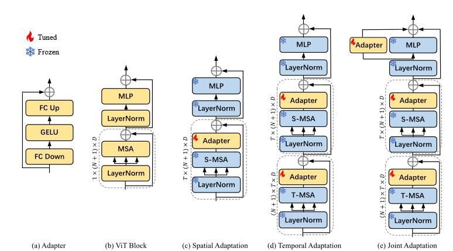
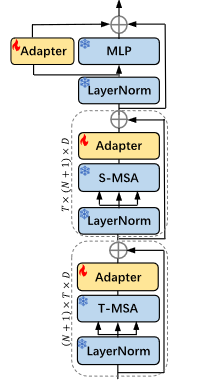
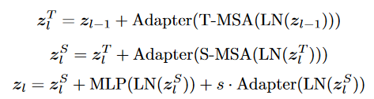
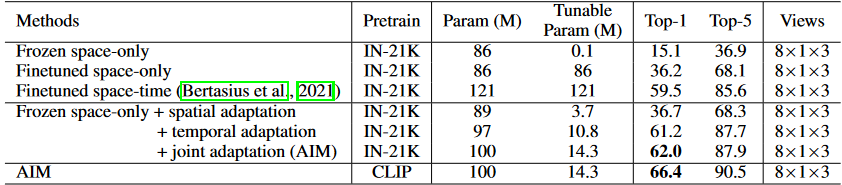

**AIM: ADAPTING IMAGE MODELS FOR EFFICIENT VIDEO ACTION RECOGNITION (ICLR 2023)**

# 模型结构图

在视频理解领域的参数高效微调,通过冻结预训练的图像模型并且加入一些轻量级的Adapter,引入了空间适应,时间适应,和联合适应使得图像模型具备时空推理的能力.更少的可调参数更强的竞争力

## 创新点

*   在预训练的图像模型上增加额外的层,使其适应视频特征
*   直接使用**viT的self-attention层(S-MSA),但是把输入的特征做了reshape,**使其成为能够获取时序的信息(T-MSA)
*   冻住预训练的图像模型,只微调增加的时空适应层

**方法:**

*   空间adapter:是一种瓶颈架构,由两个全连接(FC)层和中间的激活层组成.第一个FC层将输入投射到较低的维度,第二个FC层将输入投射回原始维度.加在自注意力层之后,称为空间适配.

    

*   时间adapter:之前加入新的tempoal moduale 往往会引入新的非常多的额外可调参数,而且新的模块需要完全微调,重新使用图像模型中预先训练好的自注意层来进行时间建模.将原有的self-attention模块叫做S-MSA,而将其拓展到时间上叫做T-MSA.对其进行一个reshape,

    $z\in R^{T\times (N+1)\times D }$

    ,reshape 为

    $z^T \in R^{N+1 \times T \times D}$

    ,其中

    $N$

    是patch数,

    $T$

    是帧数,将其输入到T-MSA中,T-MSA保证被冻住.并且在T-MSA之后也加入了一个adapter,以适应视频数据的特征,

*   为了联合时空特征,引入joint adapter,结构与之前的adapter相同

    ,

其中$s$是缩放因子用于控制Adapter输出的权重.

## 实验设置

做了消融实验,将冻住的纯空间,只训练分类头的模型(线性探针)作为baseline,然后是完全微调的空间模型,完全微调的时空模型,最后是本文的工作,分别讨论了只加spatial adaptation,在此基础上加tempoal adaptation, joint adaptation的结果.

然后是在K-400和SSv2上的实验
