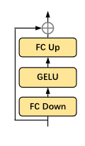

**AIM: ADAPTING IMAGE MODELS FOR EFFICIENT VIDEO ACTION RECOGNITION (ICLR 2023)**

# 模型结构图

视频理解领域的**参数高效微调**,通过**冻结**预训练的图像模型.只训练加入的一些轻量级的时空**Adapter**引入了空间适应,时间适应,和联合适应使得图像模型具备时空推理的能力,更少的消耗和调整参数,获得更好的性能.

## 创新点

*   在预训练的图像模型上增加额外的层,使其适应视频特征
*   直接使用**viT的self-attention层(S-MSA),但是把输入的特征做了reshape,**使其成为能够获取时序的模块(T-MSA),但实际没做改变,其也**不被微调**
*   冻住预训练的图像模型,只微调增加的时空适应层
*   将加入的时空适应层(adapter)进行了组合,获得了更好的效果

## **方法:**

*   如上图(**a**)空间adapter:是一种瓶颈架构,由两个全连接(FC)层和中间的激活层组成.第一个FC层将输入投射到较低的维度,第二个FC层将输入投射回原始维度.其加在**空间自注意力层(S-MSA,就是预训练模型的自注意层)**之后,称为空间适配.

    

*   时间**adapter**:(加入新的**tempoal moduale** 往往会引入新的非常多的额外可调参数.而且新的模块需要完全微调)因此重新使用图像模型中预先训练好的自注意层来进行时间建模**\(T-MSA就是预训练模型的自注意层与S-MSA没有区别\)**.但是**对于输入自注意力层的特征进行了reshape**, 将  $z\in R^{T\times (N+1)\times D }$,reshape 为$z^T \in R^{N+1 \times T \times D}$,其中$N$是patch数,$T$是帧数,将其输入到T-MSA中.并且在T-MSA之后也加入了一个adapter,以适应视频数据的时间特征**\(注意T-MSA和S-MSA都被冻住,不进行微调\)**

*   为了联合时空特征,引入joint adapter,结构与之前的adapter相同,**每一个时间,空间,联合输出的特征如下公式**:

    

    
    

其中$s$**是缩放因子用于控制joint Adapter输出的权重**.

## 实验设置

* 消融实验,将冻住的纯空间,只训练分类头的模型(**线性探针**)作为baseline,然后是完全微调的空间模型,完全微调的时空模型,最后是本文的工作,分别讨论了只加spatial adaptation,在此基础上加tempoal adaptation, joint adaptation的结果.

* 然后是在K-400和SSv2上的实验，也取得了不错的效果.

  
