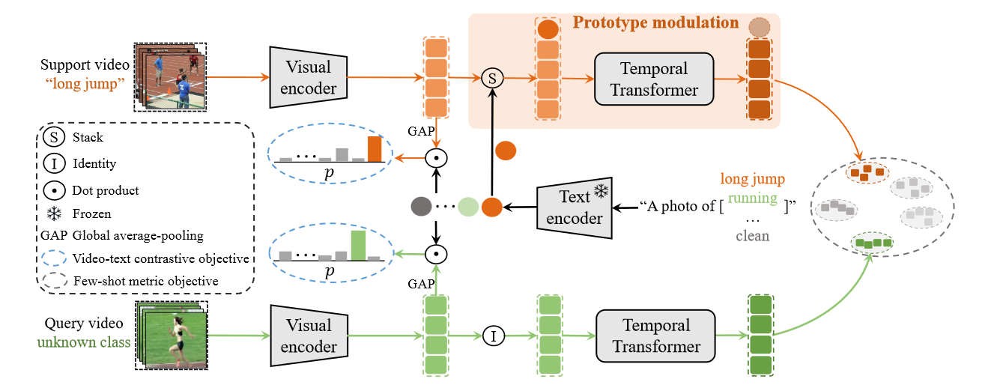
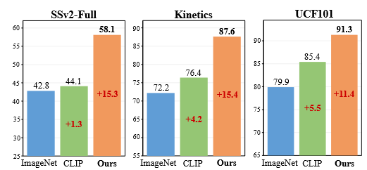
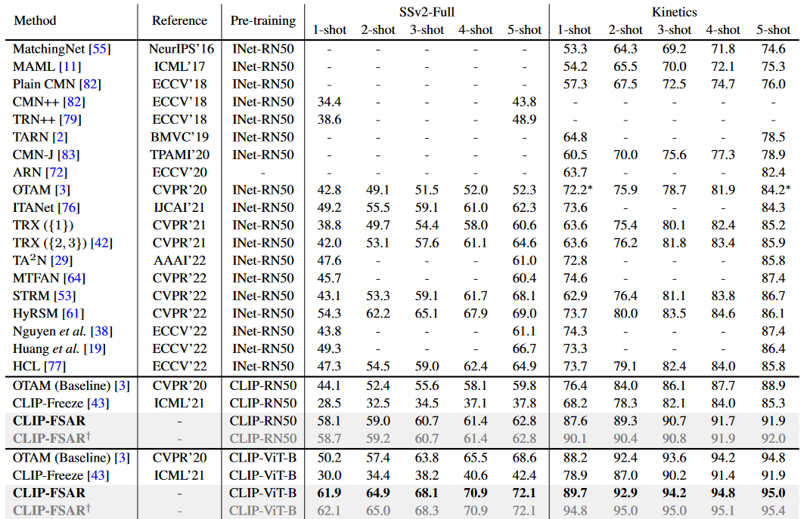
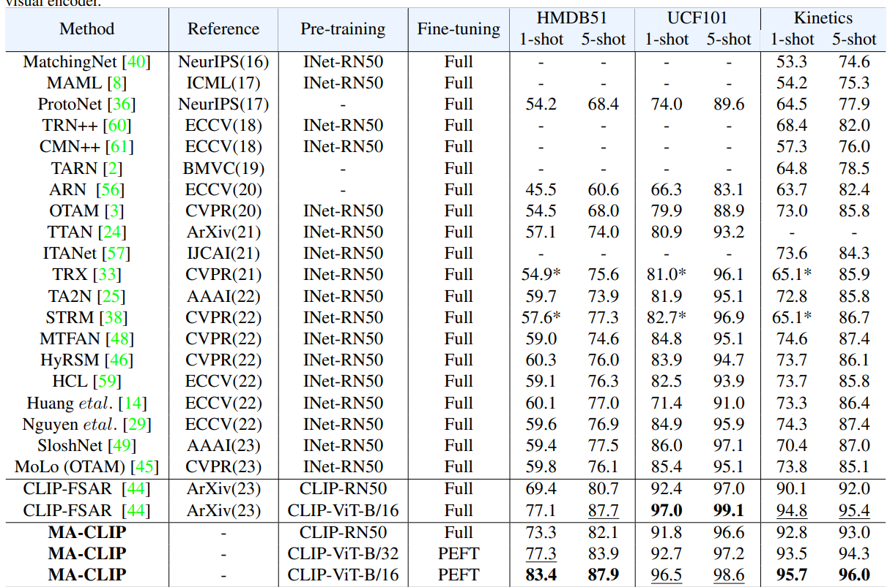
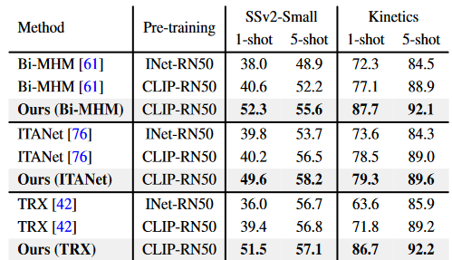

<link rel="stylesheet" href="custom.css">

**CLIP-guided Prototype Modulating for Few-shot Action Recognition（IJCV在投）**

# 模型结构图

## 方法

其使用了CLIP来指导其做few-shot learning时候的原型生成。CLIP是一个跨模态的pre-trained模型，CLIP的backboone部分，视觉可选Resnet和VIt，文本部分则使用transformer。

### 训练阶段

- 加载视觉编码器和文本编码器来分别提取视频和类别的特征

- 冻住文本编码器（**提供知识的可迁移性，减少优化负担**）

- **将提取的两种特征计算相似性，进而计算对比学习的loss**（相比于直接加载CLIP预训练模型，提点的主要创新就是用这个文本的特征按照CLIP的方式去在去训练模型）

  

  具体就是计算出文本和视频的匹配程度,通过交叉熵计算其损失:
  $$
  p_{(y=i | v)}^{video-text}=\frac{\exp \left(\operatorname{sim}\left(\operatorname{GAP}\left(f_{v}\right), w_{i}\right) / \tau\right)}{\sum_{j=1}^{B} \exp \left(\operatorname{sim}\left(\left(\operatorname{GAP}\left(f_{v}\right), w_{j}\right) / \tau\right)\right.}
  $$
  其中$sim$是余弦相似性,$GAP$是全局平均池化,$w_i$是某一类的文本特征,$v\in \{s_1,s_2,...,s_N,q\}$,($q$是query video),通过每个类别的概率值,通过交叉熵计算出视频-文本对损失,也就是$\mathcal{L}_{video-text}$

- 将**support video**的两种特征(**图像编码器得到的图像特征和文本编码器得到的文本特征**)进行拼接:($R^{t \times C}\bigcup R^C \rightarrow R^{(t+1)\times C}$),将拼接后的特征输入到**tempoal transformer** 得到原型(prototype).

- query video 不通过text Encoder ，其只使用视觉特征进行查询,通过这个计算出few-shot的损失
  $$
  d^{\prime}_{q,s_i} = \mathcal{M}(\tilde{f_q},\tilde{f_{s_i}}) \quad p^{few-shot}_{(y=i|q)} = {\frac{exp(d^\prime_{q,s_i})}{\sum^N_{j=1}exp(d^\prime_{q,s_j})}}
  $$
  同样也是使用交叉熵计算$\mathcal{L}_{few-shot}$,  $\tilde{f_q},\tilde{f_{s_i}}$是support video和query video的特征

- 通过query与原型的比较，得到few-shot loss ，将两种loss加起来做更新
  $$
  \mathcal{L} = \mathcal{L_{video-text}}+\alpha \mathcal{L_{few-shot}}
  $$
  

### 测试阶段

- CLIP能做zero-shot预测，因此可以其将CLIP的zero-shot预测与few-shot预测合并起来(可选项,也可只使用few-shot的预测)

- $$
  p_{(y=i | q)}^{\dagger}= (p_{(y=i | q)}^{video-text})^{\beta}  \cdot (p_{(y=i | q)}^{few-shot})^{1-\beta}
  $$
  
  
  
  

### 实验设置

- 在5个benchmark(SSv2-Full , SSv2-Small, Kinetics, UCF101, HMDB51)上做了实验,同时做了详细的消融实验.

- 采用 **OTAM**  作为基准对齐度量。按照之前的方法，从每段视频中**均匀、稀疏地抽取 8 个帧**来编码视频表示。在训练过程中，采用了几种标准的**数据增强技术**，如随机裁剪和色彩抖动。
- 加载了两种pre-trained backbone(CLIP-RN50和CLIP-ViT-B(Vit-B/16)),使用水机采样的10000个task做测试.(CLIP-RN50与INet-RN50在训练使用的数据集上不同)

### 与当前SOTA模型对比

- 其在Kinetics，UCF101，SSv2，HMDB51上做了实验，**5-way K-shot 其中K 从 1到5**
- 

- 其加载ViT的模型在各个数据集上均取得了最好，但是今年另一篇文章**超过了它的效果**，其同样也是使用了CLIP（Xing J, Wang M, Hou X, et al. Multimodal Adaptation of CLIP for Few-Shot Action Recognition[J]. arXiv preprint arXiv:2308.01532, 2023.）
- 

### 消融实验

如下图:

### plug and play

- 作为一个即插即用的模型，该方法还可加在其他的方法上来**提升效果**，没看过其他方法不清楚在干嘛。

  
