**Learning Discriminative Representations for Skeleton Based Action Recognition**（CVPR2023）

# 模型结构图

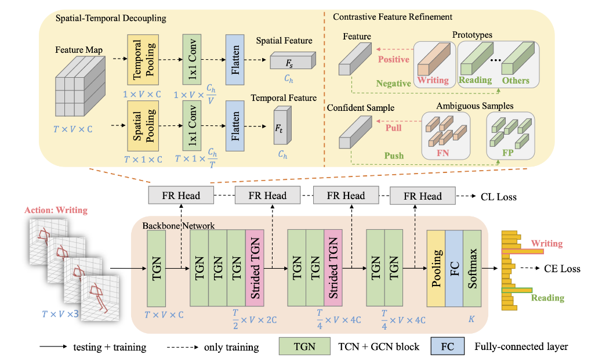

### 方法

- #### 创新点

  - 提出了一种使用对比学习的模块
  - 该模块将模型每一个stage提取的特征进行了时空解耦（用于区分时空要求不同的动作）
  - 使用对比学习进行了特征细化（提升模糊特征区分能力）
  - 将该模块运用在模型的不同的stage上（精细化特征）

- #### 具体实现

  - 时空解耦：通过对特征不同维度进行池化得到，同时注意要过一个**1X1卷积**，缩放某一维度，以便flatten之后能够得到尺寸一样的向量

  - 对比学习：

    - 在一个batch中，根据每一个类别，例如类别k，将样本分为（TP，FP，FN）。根据模型每一个batch的标签和预测结果，将模型分为分类正确（TP），将其他类错误分为类别k（FP），将类别k错误分为其他类（FN）。

    - 在一个batch中，利用每一个类别的分类正确样本计算该类的原型（prototypes），例如第k类的原型计算公式如下（涉及之前原型的更新，因此是**全局特征**）：

      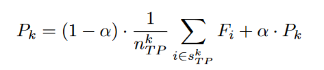

    - 同时计算一个batch中第k类的使用FP，和FN样本的**局部特征**：

      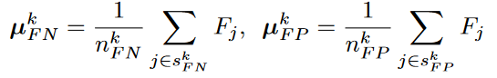

    - 对于第k类相关的模糊样本（FN，FP），进行校正（就是让$FN$离**分类正确**的$F_i$越来越近，让$FP$离**分类正确**的$F_i$越来越远）：
      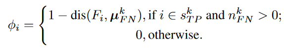

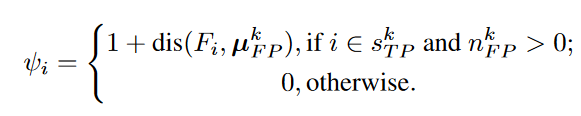

- #### 对比学习的损失：

  这里的$i$是第k类

  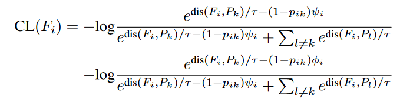

- 总的损失：

  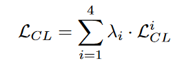

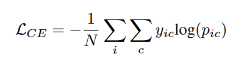

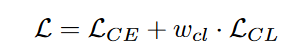

## 实验设置

- ### 数据集

  数据集为 **NTU RGB+D** 和**NTU RGB+D 120**，**NW-UCLA**

- ### 消融实验

  - 加时空解耦，对比损失等

    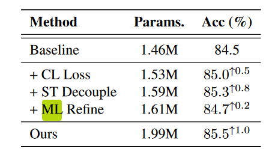

  - 不同stage特征的权重

    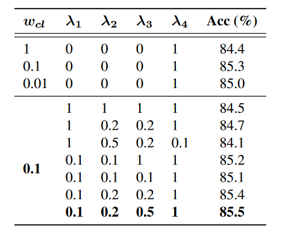

- ### SOTA

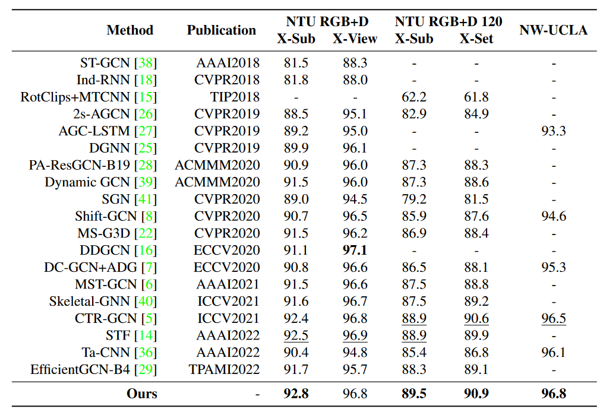

