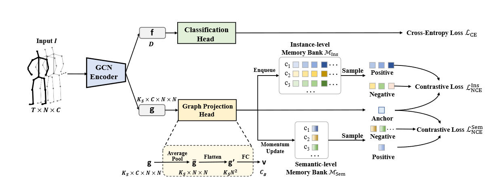
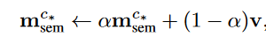
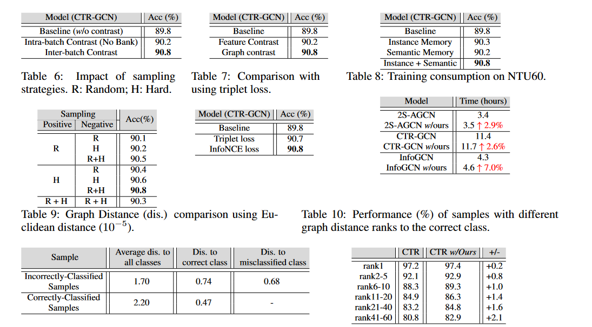
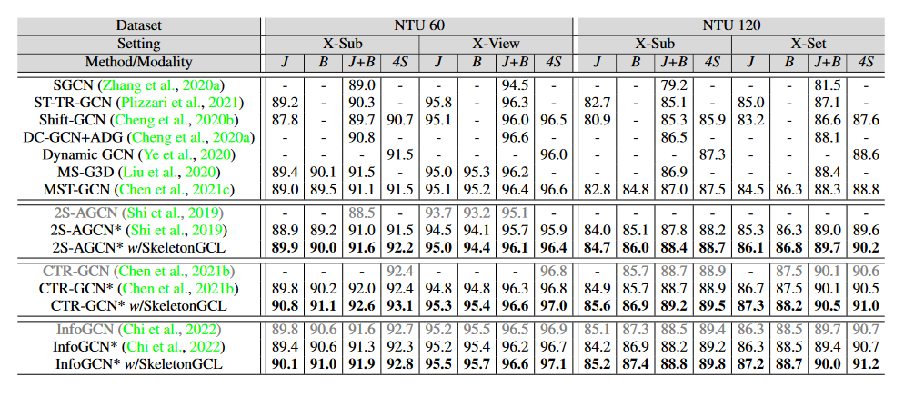

<link rel="stylesheet" href="custom.css">

**Graph Contrastive Learning for Skeleton-based Action Recognition**（ICLR2023）

# 模型结构图

## 方法

- ### 创新点

  - 提出了一种新的骨骼动作识别训练方法**SkeletonGCL**
  - 使用模型生成的不同序列之间的**学习图**进行对比
  - 构建了**实例级别和语义级别的Memory Bank**用于对比学习

- ### 具体实现

  - 将模型对样本生成的图数据（$Ks\times C \times N \times N$）,先通过平均池化，Flatten，和一个全连接，得到尺寸为$c_g$的向量$v$,其中$c_g$为类别数

  - 将特征向量$v$，加入实例级别和语义级别的Memory Bank,其中实例级别容量为q，采用**先进先出**的方式更新，**语义级别更新方式**如下：

    

    

  - 使用对比学习的一般方法，将输入样本的特征向量$v$记为锚点，从两个Memory Bank中抽取正负样本（同一类为正样本，不同类为负样本）

  - hard sampling：由于实例级别Memory Bank的数量远多于语义级别的，因此，通过hard sampling的方式抽取部分。（通过计算与当前样本的余弦相似性，选**相似性最低的正样本，相似性最高的负样本**）

## 实验

- ### 消融实验

  

- ### SOTA

  

