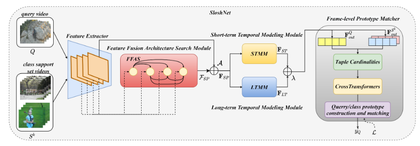

<link rel="stylesheet" href="custom.css">

本文提出了一种称为SloshNet的少样本动作识别框架，其创新点在于将空间、长期时间和短期时间特征集成到一个统一的框架中。首先，通过特征融合架构搜索模块（FFAS），自动搜索不同情景下低级和高级空间特征的最佳融合结构，以增强空间特征的表示能力。其次，基于提取的空间外观特征，引入长期时间建模模块（LTMM）来建模全局时序关系。同时，设计了另一个短期时间建模模块（STMM），对相邻帧表示之间的运动特征进行编码，并探索长期和短期时间特征的最佳集成方式。对于类原型匹配器，采用了TRX方法进行帧级匹配，利用注意力机制将查询子序列与支持集中的所有子序列进行匹配并整合证据。\
本文的主要贡献可以总结如下：

*   提出了一种名为SloshNet的简单而有效的网络，该网络通过强大的空间-时间特征提取，实现了少样本动作识别。
*   引入了FFAS模块，自动搜索低级和高级空间特征的最佳融合结构，提高了特征的空间表示能力。
*   设计了LTMM和STMM模块，分别建模了长期和短期时间特征，实现了对全局时序关系和局部时序关系的建模。
*   在TRX方法的基础上采用注意力机制，提高了类原型匹配器的匹配效果。\
    作者通过在SSV2数据集上进行实验证明了每个模块和整个框架的有效性，并展示了SloshNet的学习注意力的效果。\[2]\
    该研究的创新点在于将空间、长期时间和短期时间特征进行了有效集成，并通过FFAS模块自动搜索最佳的特征融合结构。此外，作者还引入了LTMM和STMM模块，对全局和局部的时序关系进行建模。通过这些创新，SloshNet实现了较好的动作识别性能。
