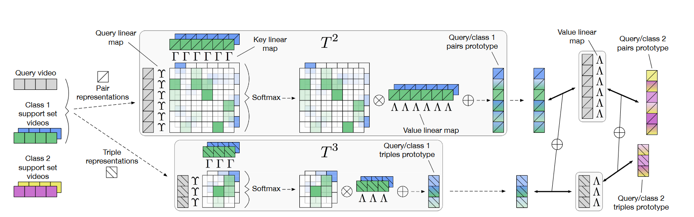

**Temporal-Relational CrossTransformers for Few-Shot Action Recognition**

# 模型结构图



使用了crossTransformer注意力机制来构建类原型,而不是使用类平均值或者单一最佳匹配.

## 创新点

*   将查询集(query set)与支持集(support set),通过注意力机制进行匹配,进而构建了类原型,提出了**TRX模块**
*   通过选帧(2帧或3帧),将所有帧数组合进行了遍历计算**TRX**,同时将遍历结果进行了平均
*   将不同选帧进行了组合

## 方法

* 首先是跟TSN一样,每个视频均匀采样8帧,其将每个视频的8帧进行抽样,例如8帧中选两帧,那么就有$C^{2}_8$种选法,那么所有可能的采样集合$\left.\Pi=\left\{\left(n_1, n_2\right) \in \mathbb{N}^2: 1 \leq n_1<n_2 \leq F\right)\right\}$,其还抽样了三帧,将这两种方式的结果进行了组合(平均)

  ```python
  all_logits = [t(context_features, context_labels, target_features)['logits'] for t in self.transformers]
            all_logits = torch.stack(all_logits, dim=-1)
            sample_logits = all_logits 
            sample_logits = torch.mean(sample_logits, dim=[-1])
  ```

* 其使用以下公式得到query的表示,support 同理.$p_1,p_2$ 代表抽样的两帧图片

    $$
    Q_p=\left[\Phi\left(q_{p_1}\right)+\operatorname{PE}\left(p_1\right), \Phi\left(q_{p_2}\right)+\operatorname{PE}\left(p_2\right)\right] \in \mathbb{R}^{2 \times D} \\
    
    S^c_{km}=\left[\Phi\left(s^c_{km_1}\right)+\operatorname{PE}\left(m_1\right), \Phi\left(S^c_{km_2}\right)+\operatorname{PE}\left(m_2\right)\right] \in \mathbb{R}^{2 \times D}
    $$
    其中$m \in \Pi$$,D$ 为卷积网络提取特征的维度,这里resnet50是1024(预训练在Imagenet).

* $S^c$在这里做了一个堆叠,现在尺寸变为了 视频数$\times$(2 or 3)$\times$1024, $\mathbf{S}^{c}=\left\{S_{k m}^{c}:(1 \leq k \leq K) \wedge(m \in \Pi)\right\}$,$c$为support video的某一类。

  ```python
   s = [torch.index_select(support_set, -2, p).reshape(n_support, -1) for p in self.tuples]
   q = [torch.index_select(queries, -2, p).reshape(n_queries, -1) for p in self.tuples]#tuple为采样两帧的组合,格式为tensor([0,1])
   support_set = torch.stack(s, dim=-2)
   queries = torch.stack(q, dim=-2)
  ```

* 然后是通过两个线性层计算support set和query set的K,V值(使用的linear layer是共享权重的),之后再计算其不同类别的分数(**拿query的K与support的K进行计算分数**),同时对获得的分数做了一个$Softmax$ 操作

  $$
  \Upsilon,\Gamma : \mathrm{R}^{2\times D} \rightarrow \mathrm{R}^{d_k} \quad and \quad \Lambda:\mathrm{R}^{2\times D} \rightarrow \mathrm{R^{d_v}}\\
  a^c_{kmp} = L(\Gamma \cdot S^c_{km}) \cdot L(\Upsilon\cdot Q_p)\\
  \tilde{a}^c_{kmp} = \frac{exp(a^c_{kmp})/ \sqrt{d_k}}{\sum_{l,n}exp(a^c_{lnp})/\sqrt{d_k}}
  $$

  ```python
  class_scores = torch.matmul(mh_queries_ks.unsqueeze(1), class_k.transpose(-2,-1)) / math.sqrt(self.args.trans_linear_out_dim)
  ```

  注意这里的$p$是对query video的两帧或三帧组合的一种,上述公式的$k,m$代表类别$c$的第$k$个视频和帧组合的第$m$个,因此接下来会对$k和m$进行加权和,得到support set类别$c$,对于query video的两帧或三帧组合$p$的原型,公式如下:
  $$
  t^c_p = \sum_{km}\tilde{a}^c_{kmp}\mathrm{v}^c_P{km}
  $$

* 计算query的两帧或三帧组合$Q_p$与support set中类别$c$,计算距离:
    $$
    T\left(Q_{p}, \mathbf{S}^{c}\right)=\left\|\mathbf{t}_{p}^{c}-\mathbf{u}_{p}\right\|
    $$

*   由于$p$是所有两帧(三帧)组合的一种,因此最后对**所有组合进行了平均**,得到最终queryvideo Q关于类别c的距离
    $$
    T\left(\mathbf{Q}, \mathbf{S}^{c}\right)=\frac{1}{|\Pi|} \sum_{n \in \Pi} T\left(Q_{p}, \mathbf{S}^{c}\right)
    $$

- 跟据上述的公式,对两帧和三帧的结果进行了平均:
  $$
  \mathbf{T}^\Omega\left(Q, \mathbf{S}^{c}\right)= \sum_{\omega \in \Omega} T^\omega\left(Q^\omega, \mathbf{S}^{c\omega}\right)
  $$
  其中$\Omega = \{2,3\}$。 

## 实验设置

TRX使用共享的backbone网络,在使用5-way 5-shot在五个数据集上做了测试,包括Kinetics, 两种分割方式的SSv2,HMDB,UCF

*   数据集使用Kinetic,SSv2,HMDB和UCF,其中Kinetic和SSv2使用的是CMN这篇文章的分割方式,HMDB和UCF使用的是ARN的分割方式
*   每次只迭代一个任务,每16次**更新一次梯度**.
