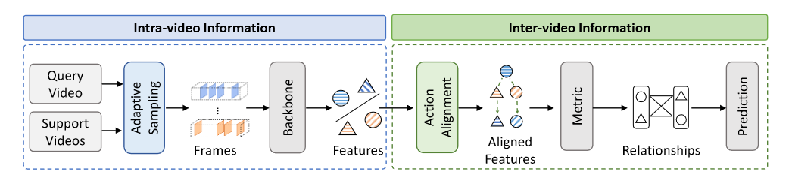
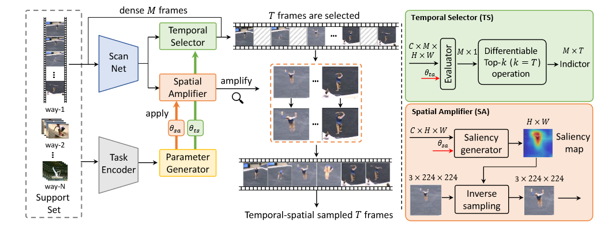

**Few-shot Action Recognition via Intra- and Inter-Video Information Maximization**

## 问题

1.对于视频内信息，大多数方法**主要关注特征表示学习，而很少关注输入视频的处理**。这些方法通常对每个视频沿空间和时间维度进行统一的帧采样，以生成相应的帧输入。这可能会遗漏关键的动作内容，并容易受到视频片段中无关部分的冗余和干扰，从而降低视频内信息的利用效率。

2.在视频间信息方面，由于不同的动作实例显示出不同的空间和时间分布，视频间存在严重的动作错位问题

为了克服这些限制，设计了一种新颖的框架，称为视频信息最大化（VIM），用于少镜头动作识别。如图 1 所示，VIM 为传统的识别管道引入了两个创新步骤：视频自适应采样和动作对齐。前者的目标是在数据层面上实现视频内信息最大化，而后者则侧重于在特征层面上实现视频间信息最大化。在这个框架中，我们通过特定任务的时空视频采样器来实现自适应采样，通过对帧的时间选择和空间放大来提高视频的利用效率。同时，通过时空动作对齐模型实现动作对齐。该模型可学习解决空间和时间维度上的不对齐问题，从而更准确地测量视频之间的关系。这样，在 VIM 中，视频采样器和动作对齐步骤相辅相成，最大限度地提高了整体视频信息的质量。

## 方法

*   pipleline

    将support video和Query video 输入到adaptivate sampling 自适应的采样T帧然后，使用特征提取器（即backbone）为每个视频生成特征表示。根据这些特征，**动作配准会在查询视频和支持视频之间进行配准**，从而为视频对生成配准良好的特征。最后，使用特定指标计算视频之间的关系（如距离、相似度）。

* Task-adaptive spatial-temporal video sampler

    

    *   video scan（遍历视频）

        首先对每一个视频进行密集采样M帧，每一个视频可以由帧的序列表示$X_D= {X_1, X_2, …, X_M}$,该序列长度为$M$ ，该模块的目的是从$X_D$,中按空间和时间采样出$X_D$的子集$X$,$X$的长度为$T<M$,首先对$X_D$使用了一个轻量级的ScanNet，将帧作为输入，获得相应的帧级特征$f_{X_D} = \{f (X_1), . . . , f (X_M )\} \in R^{c×M×h×w}$,为了减小计算量，每一个帧都会缩放到一个较小的尺寸（64X64），该视频的video-level representation $g_{X_D} = \frac{1}{M} \sum_{i}^{M} f (X_i) \in R^{c×h×w}$,是$M$帧特征的平均

    *   Tempoal selector

        *   Evaluation： evaluator $\phi _{eal}$,可以得到视频的每一帧的重要性分数，其接收frame-level级的特征（$C \times M \times H \times W$）作为输入，得到$M$帧的重要性分数,同时输入的还有上面得到的视频全局特征$g_X$，将这两个级别的特征concat起来，具体计算公式如下：

            $s_i = \phi _{eval}(Avg(Cat(f (X_i), g_X))+ PE(i))$,$\phi_{eval} = w_2(ReLU(w_1(.))$,其中$i$是视频的某一帧。（为啥要一个视频的全局空间特征，时间评估器就是两层的全连接，Avg是空间上的全局平均池化，也就是将H X W变为1，PE 是位置编码）

        *   然后将得到的分数进行归一化，同时选出其topk（k=T），将选出的T个索引按时间顺序排列，同时转换成one-hot向量，因此返回的是M X T的矩阵，M是one-hot向量的长度，这样也便于将选出的帧提取出来。

        *   differentiable的top-k算法

    * Spatial amplifier

        *   基于注意力的非均匀采样应用，使用了一种空间放大器（SA），

        * **Saliency map**，应该是将上述得到的frame-level级的特征输入到这个模块中，然后将该特征

            $C \times H \times W$,在通道维度做（类似自注意力的机制），
            $$
            α = \frac{f(X)f(X)^T}{\sqrt{h \times w}} \in R^{c×c}, f (X)′ = αf(X) \in R^{c×h×w}
            $$
            ,得到类似于注意力分数的东西，然后计算他的saliency map：
            $$
            M_s \in R^{h\times w} = \frac{1}{c} \sum_i^c w_{s_i} \cdot f(x)
            $$
            其中的$w_i$是一个可以学习的参数。

        *   Amplification：根据显著性地图，其空间采样规则是，**具有较大显著性值的区域应被赋予较大的采样概率**（即，在这种情况下，我们说该区域与其他区域相比将被 "放大"）。我们通过 中使用的反变换采样来实现上述放大过程。如图 5 所示，我们首先通过计算轴上的最大值，将显著性地图 Ms 分解为 x 维和 y 维，然后按照的方法进行稳定：

            分解为x维:
            $$
            M_x = \max\limits_{1\leq i\leq W}(M_s)_{i,j} \quad M_y = \max\limits_{1\leq i\leq H}(M_s)_{i,j}
            $$
            考虑非均匀且单调的累积分布函数，得到它们各自的分布，因此计算了反采样函数。最后根据网络对原始图像进行仿射变换，得到最终的放大图像
            
            
            $$
            X^\prime_{i,j} = \mathrm{Func}(F,M_s,i,j) = X_{D_x^{-1}(i),D^{-1}_y(j)}
            $$
            

    *   Task-adaptive learner：在一般的动作识别中，一旦采样器训练有素，就会以固定的策略和标准对每个测试视频进行采样 [58,37]。然而，在少镜头插曲范例中，查询视频依赖于支持集中的视频来进行分类。因此，与一般的动作识别相比，我们的测试视频并不独立。因此，在少镜头识别中，固定每集视频的采样策略并不理想。为此，我们的采样器采用了任务自适应学习器，它能为 TS 和 SA 中的层生成特定任务参数，从而根据手头的情节任务动态调整采样策略。

*   Spatial-temporal action alignment

    *   深入研究错位问题（如下图）
        *   由于开始时间和持续时间不同，不同视频中动作的相对时间位置通常不一致，将位置不一致的问题称为**动作持续时间错位**。
        *   由于动作通常是以非线性方式演变的，因此即使动作实例具有相同的语义类别和持续时间，它们在动作过程中的空间-时间分辨部分也各不相同。将这种动作实例之间的内部时空错位定义为动作进化错位。
        *   

*   Feature embedding

    将之间得到的时间和空间采样的T帧图片输入使用比较强的特征提取器（Resnet 50），得到特征$F_X = \{F(X_1'),F(X_2')，...,F(X_T')\}$在接下来将support set的特征称为$F_s$,query set的称为$F_q$

*   tempoal coordination

    通过时间协调（TC）模块进行时间对齐。它由时空转换和重新排列操作组成，旨在解决时空维度上的这两类不对齐问题。

    - Temporal transformation:为了解决动作时长错位问题，其目标是在时间上定位动作，然后定位并强调时长特征，同时忽略与动作无关的特征。这样就能消除时长错位。通过时间转换模块来实现这一目标。该模块由两部分组成：定位网络 L 和时态仿射变换 T。具体来说，给定输入帧级特征序列 $F(X)$，定位网络首先生成warping parameters φ = (a, b) = L(FX)。然后通过**仿射变换 Tφ** 对输入特征序列进行扭曲。简而言之，时态变换过程定义如下:

      $\hat{F_X} = T_\phi{F_X},\phi=L(F_X)$,其中，$\hat{f_X}$ 表示与动作持续时间对齐的特征序列，**L 在我们的实现中由多个轻型可训练层组成**。由于帧序列间的动作持续时间错位具有线性特征，因此采用线性时间插值来表示warping。

      

    - Temporal rearrangement

      为使视频中的动作演化在时间上保持一致，类似的运动模式视频之间的运动变化应聚集到相同的时间位置。我们将此视为一项全局重新排列任务，其中查询视频的运动演化可在时间上重新排列以匹配支持视频。因此，我们将支持视频与查询视频之间的演化相关性 Me∈ RT ×T 建模为
      $$
      \mathbf{M}_{e}=\operatorname{softmax}\left(\frac{\left(W_{k} \cdot G\left(\hat{F}_{s}\right)\right)\left(W_{q} \cdot G\left(\hat{F}_{q}\right)\right)^{T}}{\sqrt{\operatorname{dim}}}\right)
      $$
      其中$W_k,W_q$是线性层，$G$是全局平均池化G 是空间维度上的全局平均池化，其输出张量形状为 C × T × 1 × 1，即只在时间维度 计算相关性，Softmax 将 $M_e$ 中的值限制为 [0, 1]。依照这个对query video进行重排$\tilde{F}_{q}=\mathbf{M}_{e} \cdot\left(W_{v} \cdot G\left(\hat{F}_{q}\right)\right)$。

- Spatial Coordination

  

​	
