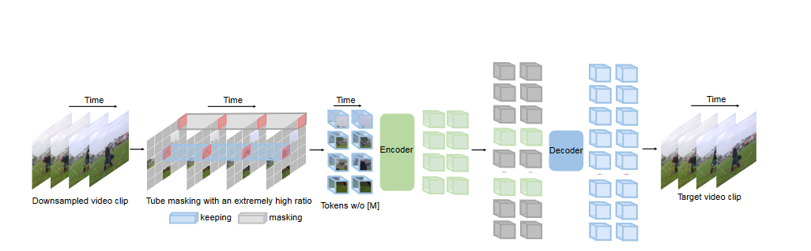
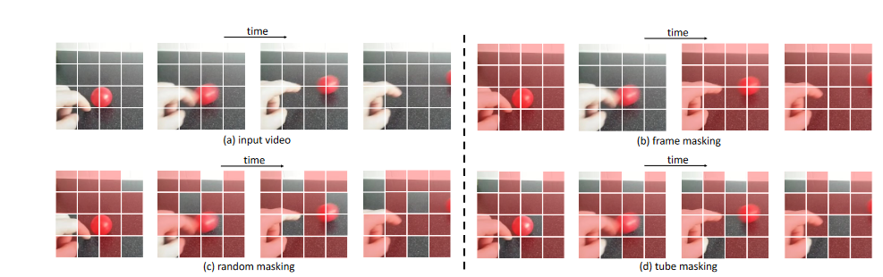
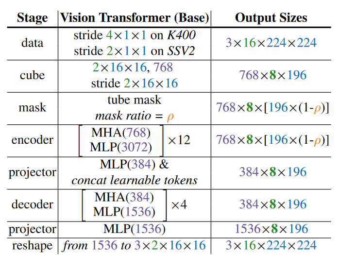

**VideoMAE: Masked Autoencoders are Data-Efficient Learners for Self-Supervised Video Pre-Training(NeurIPS 2022)**

# 模型结构图

### 现有问题

* 由于视频的语义特征在时空变化的时候难以正常的mask（如果按照MAE在空间上随机mask的方式，可能会导致当前mask的会在接下来的帧数暴露出来），因此使用**静态图像的掩膜方式得到效果往往不理想**(类似于MAE的图像随机mask方式)

  回顾图像MAE的loss function如下:
  $$
  \mathcal{L} = \frac{1}{\Omega}\sum_{p\in\Omega}|I(p)-\hat{I}(p)|^2
  $$
  $p$是token index,$\Omega$是被mask的token的集合,$I$是输入的图像,$\hat{I}$是重建的图像。

### 创新点

- 由于video data存在的时间冗余性(tempoal redundancy)和时间相关性(tempoal correlation),时间冗余性导致就算是很高的masking ration,也能够恢复像素(recover pixels)。时间相关性使得使用随机mask的和frame mask的,很容易重建像素通过找邻接的帧。
- 针对上述问题提出了tube masking,对于所有帧都mask相同的patch。

*   提出了一个视频领域的类似MAE的自监督预训练模型（SSVD，self-supervised video pre-training）（优于从头开始训练或使用对比学习方法预训练的模型）
*   相比于对比学习，VideoMAE 进行 预训练的**数据量较小**（3.5k）

### pipline

首先是将通过Downsampled video clip作为输入,然后使用提出的Tube masking方法进行掩膜(注意使用了extremely high ratio的mask),获得其token(将image作为patch输入),Encoder-Decoder架构,得到重建出来的video-clip。进而进行训练。

### 方法

* Downsampled,首先是将输入的视频随机采样$t$帧的连续帧,然后按照(tempoal sampling)采样到T帧,不同数据集的间隔不一样。

* Cube embedding,将每一个$2\times 16 \times 16$的子立方体作为一个token,因此获得了$\frac{T}{2}\times\frac{H}{16}\times\frac{W}{16}$个tokens。同时将3D token映射到D(就是将原来的3维映射成1维)

*   设计了一种$tube  masking$的mask方法（videoMAE倾向于使用更高的mask ratio）,tube masking 将mask拓展到整个时间轴，即**不同帧共享同一个mask**

    

*   tempoal downsampling 时间下采样

    使用分步时间采样策略来进行更有效的视频预训练，形式上首先从原视频V中随机抽取一个由t个连续帧组成的视频，然后使用时间采样将片段压缩为 T 个帧，每个帧包含 H × W × 3 个像素（通过时间下采样来避免时间冗余，即通过对视频选取帧，来避免）

*   backbone

    使用了vanilla ViT backbone 以便于能够更好的捕捉时空联合信息，使用了联合时空注意力机制

    

### Experiment

- 数据集,使用了K-400, SSv2, UCF101,HMDB51,和AVA上做了实验。
